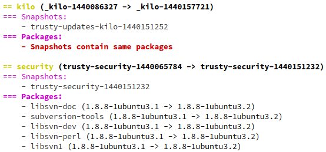

============
python-aptly
============

Aptly REST API client and useful tooling

Publisher
=========

Publisher is tooling for easier maintenance of complex repository management
workflows.

This is how workflow can look like and what publisher can do for you:

.. image:: ./doc/aptly-publisher.png
    :align: center

Features
--------

- Create or update publish from latest snapshots

  - it takes configuration in yaml format which defines what to publish and
    how
  - expected snapshot format is ``<name>-<timestamp>``

- Promote publish

  - use source publish snapshots to create or update another publish (eg.
    testing -> stable)

- Cleanup unused snapshots

- Purge publishes and repositories

- Restore and dump publishes

- Supports Python 3 (recommended) and Python 2

Create or update publish
~~~~~~~~~~~~~~~~~~~~~~~~

First create configuration file where you define Aptly repositories, mirrors
and target distributions for publishing.

.. code-block:: yaml

    mirror:
      # Ubuntu upstream repository
      trusty-main:
        # Base for our main component
        component: main
        distributions:
          - nightly/trusty
      # Mirrored 3rd party repository
      aptly:
        # Merge into main component
        component: main
        distributions:
          - nightly/trusty

    repo:
      # Some repository with custom software
      cloudlab:
        # Publish as component cloudlab
        component: cloudlab
        # Use swift storage named myswift for publish storage
        storage: swift:myswift
        distributions:
          # We want to publish our packages (that can't break anything for
          # sure) immediately to both nightly and testing repositories
          - nightly/trusty
          - testing/trusty

Configuration above will create two publishes from latest snapshots of
defined repositories and mirrors:

- ``nightly/trusty`` with component cloudlab and main

  - creates snapshot ``_main-<timestamp>`` by merging snapshots
    ``aptly-<timestamp>`` and ``trusty-main-<timestamp>``)

- ``testing/trusty`` with component cloudlab, made of repository cloudlab

It expects that snapshots are already created (by mirror syncing script or by
CI when new package is built) so it does following:

- find latest snapshot (by creation date) for each defined mirror and
  repository

  - snapshots are recognized by name (eg. ``cloudlab-<timestamp>``,
    ``trusty-main-<timestamp>``)

- create new snapshot by merging snapshots with same publish component

  - eg. create ``_main-<timestamp>`` from latest ``trusty-main-<timestamp>``
    and ``aptly-<timestamp>`` snapshots
  - merged snapshots are prefixed by ``_`` to avoid collisions with other
    snapshots
  - first it checks if merged snapshots already exists and if so, it will skip
    creation of duplicated snapshot. So it's tries to be fully idempotent.

- create or update publish or publishes as defined in configuration

It can be executed like this:

::

  aptly-publisher -c config.yaml -v --url http://localhost:8080 publish

Promote publish
~~~~~~~~~~~~~~~

Let's assume you have following prefixes and workflow:

- nightly

  - created by `publish` action when there's new snapshot or synced mirror
  - packages are always up to date

- testing

  - freezed repository for testing and stabilization

- stable

  - well tested package versions
  - well controlled update process

There can be more publishes under prefix, eg. ``nightly/trusty``,
``nightly/vivid``

Then you need to switch published snapshots from one publish to another one.

::

  aptly-publisher -v --url http://localhost:8080  \
  --source nightly/trusty --target testing/trusty \
  publish

You can also specify list of components. When you have separate components for
your packages (eg. cloudlab) and security (mirror of trusty security
repository), you may need to release them faster.

::

  aptly-publisher -v --url http://localhost:8080  \
  --source nightly/trusty --target testing/trusty \
  --components cloudlab security -- publish

Finally you are also able to promote selected packages, eg.

::

  aptly-publisher -v --url http://localhost:8080  \
  --source nightly/trusty --target testing/trusty \
  --packages python-aptly aptly -- publish

Show differences between publishes
~~~~~~~~~~~~~~~~~~~~~~~~~~~~~~~~~~~

You can see differences between publishes with following command:

::

  aptly-publisher -v --url http://localhost:8080  \
  --source nightly/trusty --target testing/trusty \
  promote --diff

Example output can look like this:

Cleanup unused snapshots
~~~~~~~~~~~~~~~~~~~~~~~~

When you are creating snapshots regularly, you need to delete old ones that
are not used by any publish. It's wise to call such action every time when
publish is updated (eg. nightly).

::

  aptly-publisher -v --url http://localhost:8080 cleanup

Purge unused packages from repo and publishes
~~~~~~~~~~~~~~~~~~~~~~~~

When you are uploading a lot version of the same package, you may want to
get rid of old packages version in your snapshots.
Be careful, the option ``--hard`` will remove the packages from your repos.

::

  aptly-publisher -v --url http://localhost:8080 --component extra --hard purge

Installation
============

You can install directly using from local checkout or from pip:

::

  python3 setup.py install
  pip3 install python-aptly

Or better build Debian package with eg.:

::

  dpkg-buildpackage -uc -us

Read more
=========

For usage informations, see ``aptly-publisher --help`` or generate and view
man page.

::

  PYTHONPATH=. help2man -n "aptly-publisher - tool for easy creation of Aptly multi component publishes" --version-string=$(grep version setup.py|cut -d '"' -f 2) "python3 aptly/publisher/__main__.py" | sed -e s,__main__.py,aptly-publisher,g -e s,__MAIN__.PY,APTLY-PUBLISHER,g > aptly-publisher.1
  man aptly-publisher.1

Also see ``doc/examples`` directory.

For examples of jenkins jobs, have a look at `tcpcloud/jenkins-jobs <https://github.com/tcpcloud/jenkins-jobs>`_ repository.

Known issues
============

- determine source snapshots correctly
  (`#271 <https://github.com/smira/aptly/issues/271>`_)
- cleanup merged snapshots before cleaning up source ones

  - before that it's needed to run cleanup action multiple times to get all
    unused snapshots cleaned
